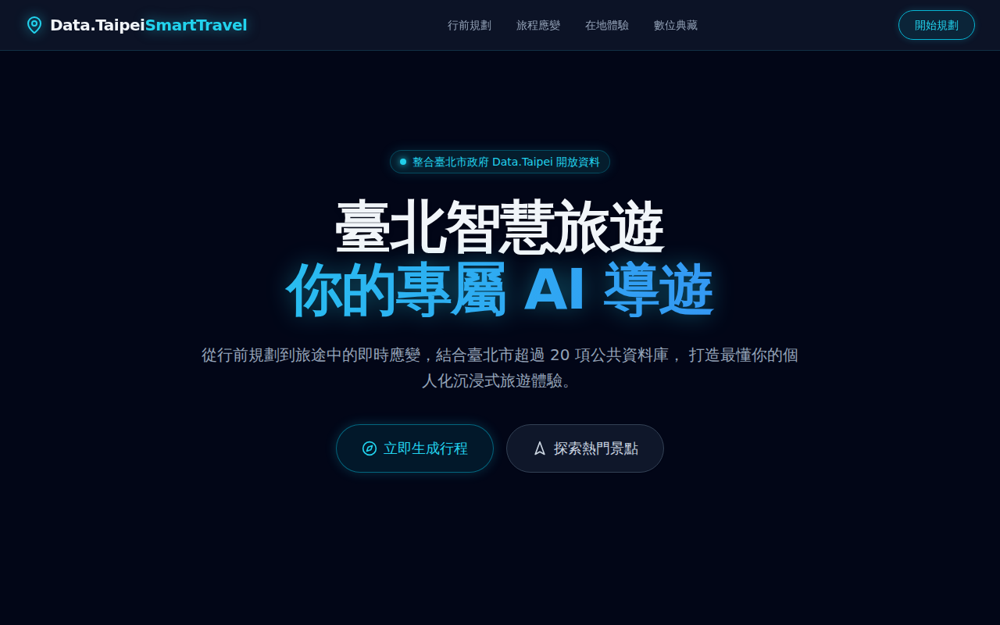

# 臺北智慧旅遊 (Taipei Smart Travel)

> 你的專屬 AI 導遊。從行前規劃到旅途中的即時應變，結合臺北市政府 Data.Taipei 開放資料與超過 20 項公共資料庫，打造最懂你的個人化沉浸式旅遊體驗。



## 🌟 核心功能 (Core Features)

### 階段一：行前智慧化行程規劃
運用 AI 模型深度理解個人偏好，並結合即時天氣與全球交通路網，打造最完美的旅遊藍圖。
- 深度使用者行為模型建立
- 出發前置準備自動化
- 反向風格化路線生成
- 全球導航地圖無縫整合
- AI 多重行程預演模擬
- 行程資訊標準化輸出與協作共享

### 階段二：旅程中即時情境感知與動態應變
無縫串接臺北市各項即時監測數據，提供最即時的交通、人潮與安全應變方案。
- 即時監控與突發事件動態重排
- 人潮趨避與生理狀態適應性調整
- 大型交通樞紐室內導航與動線指引
- 跨語言與在地文化內容
- 支出記錄與即時預算監控
- 安全警示與緊急資訊推送

### 階段三：在地文化沉浸式互動體驗
透過擴增實境與在地文化知識庫，將臺北百年歷史與藝文活動轉化為深度的互動旅遊。
- 情境式任務導覽與文化資訊解鎖
- 動態專屬 Podcast 語音導覽
- 在地文化 AI 數位分身諮詢
- AR 擴增實境時光機
- AI 驚喜偶遇引擎與短期社交媒合

### 階段四：旅遊回憶自動化彙整與數位典藏
旅行結束後，由 AI 自動將照片與軌跡轉化為精美日誌，永遠珍藏專屬回憶。
- 自動化智慧旅遊日誌生成
- 遺憾彌補與回憶創造性擴寫
- 社群媒體連動與內容自動發布

## 🛠 技術堆疊 (Tech Stack)

- **前端框架**: [React 19](https://react.dev/)
- **開發語言**: [TypeScript](https://www.typescriptlang.org/)
- **建置工具**: [Vite](https://vitejs.dev/)
- **樣式框架**: [Tailwind CSS](https://tailwindcss.com/)
- **圖示庫**: [Lucide React](https://lucide.dev/)

## 🎨 UI 設計 (UI Design)

全新的「科技風格 (Cyber Tech Style)」介面，採用了：
- **深色沉浸模式 (Dark Mode)**：深邃的 `slate-950` 背景搭配科技網格，讓視覺更專注於資料層。
- **霓虹光暈 (Neon Glow)**：使用高對比度的 `cyan` 與多色霓虹光圈，勾勒出未來感組件。
- **玻璃擬態 (Glassmorphism)**：半透明卡片與毛玻璃特效的無縫融合，呈現輕盈的科技感體驗。

## 🚀 快速開始 (Getting Started)

請確保您的環境已安裝 [Node.js](https://nodejs.org/)。

### 1. 安裝依賴套件

```bash
npm install
```

### 2. 啟動開發伺服器

```bash
npm run dev
```

伺服器啟動後，您可以在瀏覽器中開啟 `http://localhost:5173` 來檢視應用程式。

### 3. 建置生產版本

```bash
npm run build
```

建置完成的檔案將會輸出到 `dist` 目錄。

### 4. 執行程式碼檢查

```bash
npm run lint
```
